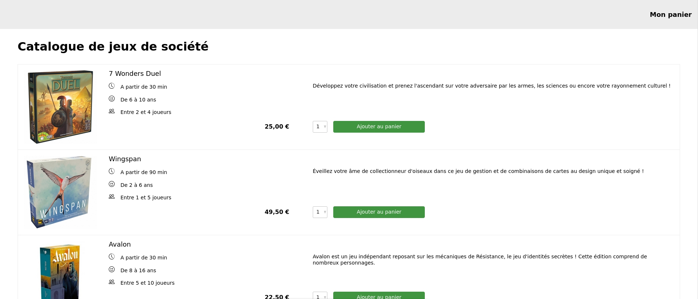
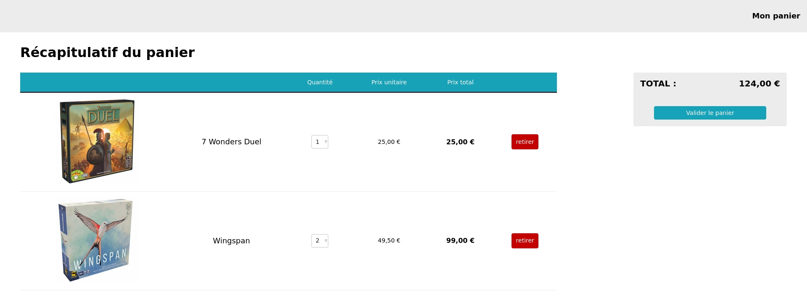

# react-test-catalogue-panier

1 - Install Yarn: https://yarnpkg.com/  
2 - Install the project dependencies: `yarn install`  
3 - Run the project: `yarn start`  

Data in db.json file, use with https://github.com/typicode/json-server

